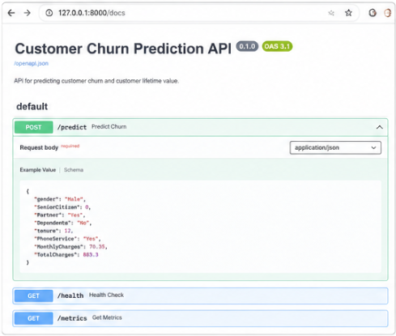
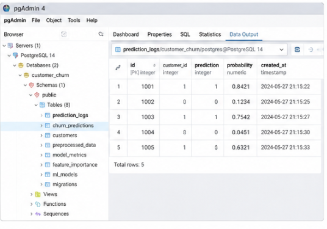
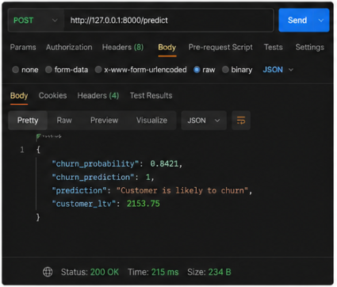
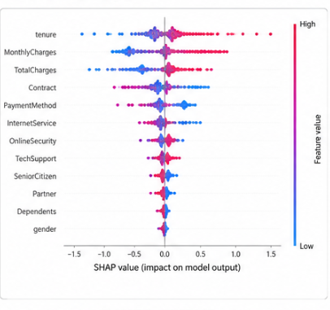
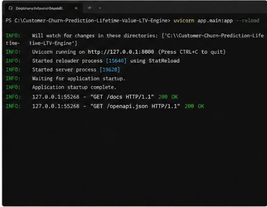
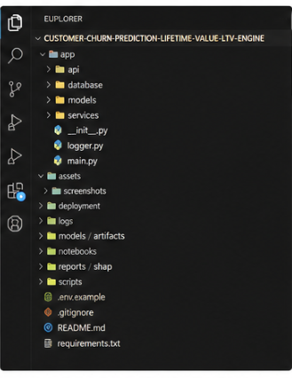

# Customer Churn & LTV Engine

## Project Overview
This project is a production-level predictive analytics platform designed for telecom and subscription-based businesses. It focuses on two key metrics:
1. **Customer Churn Prediction**: Identifying customers likely to leave the service.
2. **Customer Lifetime Value (LTV)**: Predicting the total revenue a customer will generate.

## Tech Stack
- **Language**: Python 3.9+
- **Database**: PostgreSQL (Data Warehouse)
- **ML Frameworks**: Scikit-Learn, XGBoost
- **Explainability**: SHAP
- **API**: FastAPI
- **Visualization**: Plotly, Seaborn
- **Deployment**: Docker

## Project Structure
- `app/`: Core application logic (API, Models, Services)
- `data/`: Local storage for datasets (Git ignored)
- `notebooks/`: Exploratory Data Analysis and prototyping
- `dashboards/`: Visualization configurations
- `docker/`: Containerization setup

## Setup Instructions
1. Create a virtual environment: `python3 -m venv venv`
2. Activate venv: `source venv/bin/activate`
3. Install dependencies: `pip install -r requirements.txt`
# Customer Churn Prediction & Lifetime Value (LTV) Engine

A Machine Learning powered web application that predicts customer churn and estimates customer lifetime value using FastAPI and Streamlit.

## 🚀 Features

- Predict customer churn
- Estimate customer lifetime value (LTV)
- Interactive Streamlit dashboard
- FastAPI backend API
- Machine Learning integration
- Clean project structure
- Real-time prediction system

---

## 🛠️ Tech Stack

### Frontend
- Streamlit

### Backend
- FastAPI
- Uvicorn

### Machine Learning
- Scikit-learn
- Pandas
- NumPy

### Visualization
- Matplotlib
- Seaborn

---

## 📂 Project Structure

```bash
Customer-Churn-Prediction-Lifetime-Value-LTV-Engine/
│
├── app/
│   ├── api/
│   ├── database/
│   ├── models/
│   ├── services/
│   ├── __init__.py
│   └── main.py
│
├── data/
├── models/
├── notebooks/
├── reports/
├── scripts/
├── streamlit_app.py
├── requirements.txt
└── README.md
## Features

- Customer Lifetime Value Prediction
- Machine Learning Pipeline
- SHAP Explainability
- PostgreSQL Integration
- Dockerized Deployment
- GitHub Actions CI/CD
- REST API Support
- Production Logging

---

## Tech Stack

- Python
- FastAPI
- Scikit-learn
- PostgreSQL
- Docker
- GitHub Actions
- SHAP
- Pandas & NumPy

---

## Project Screenshots

### Dashboard


### Prediction Page


### Prediction Result


### SHAP Analysis


### Docker Setup


### GitHub Actions


## Tasks Completed
- Tested FastAPI endpoints
- Added API testing scripts
- Added sample request payloads
- Improved README documentation
- Added project screenshots

## Outcome
Project is now more production-ready and easier for recruiters to understand.
