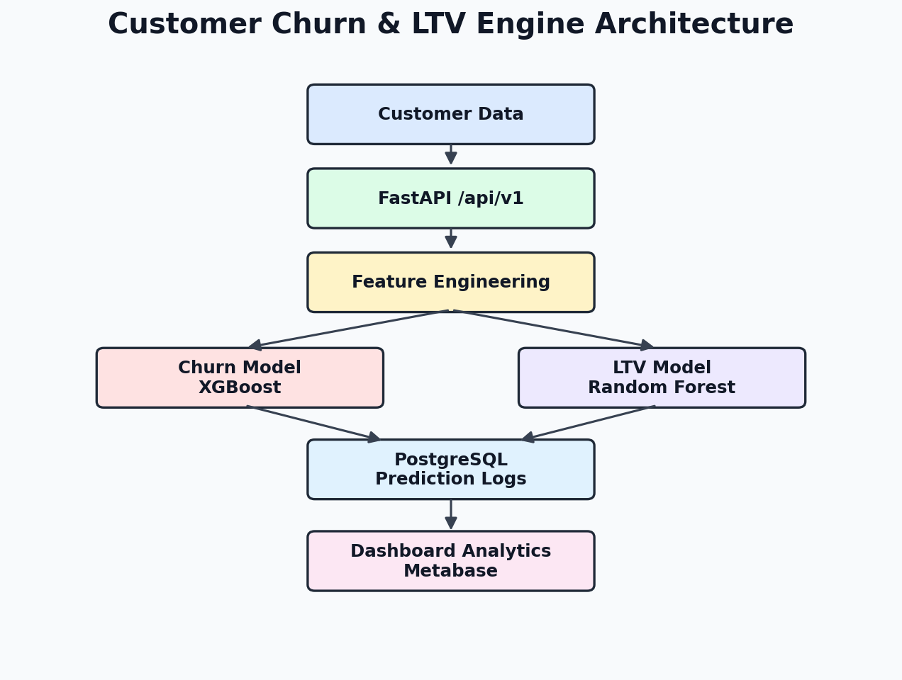
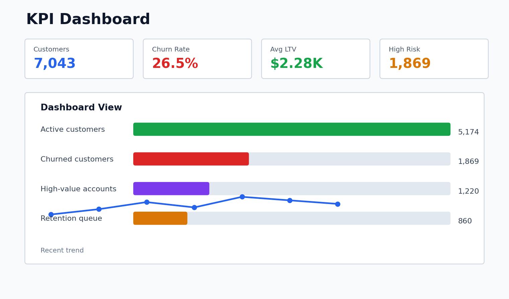
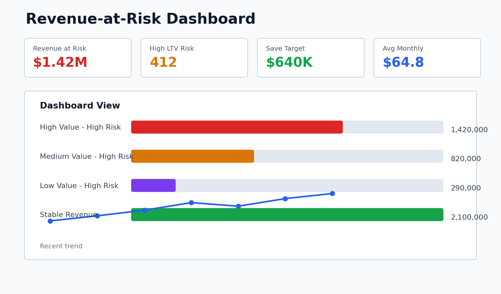
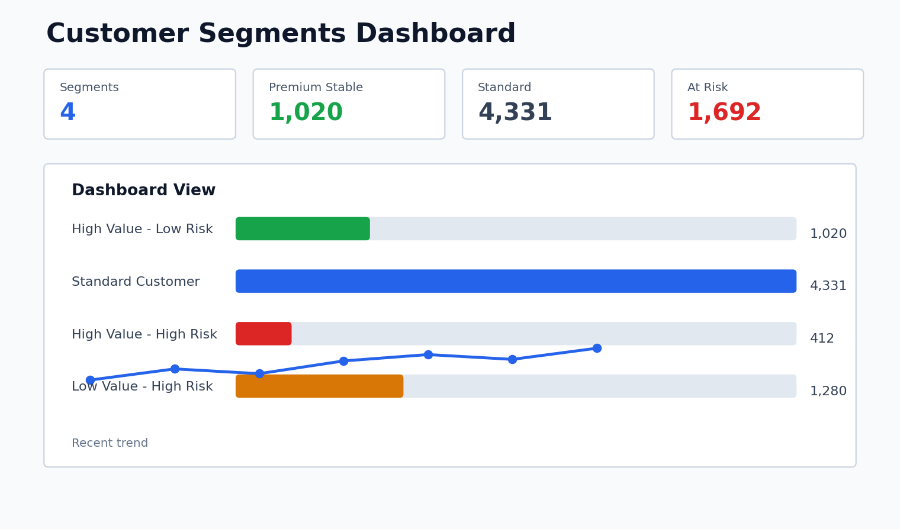
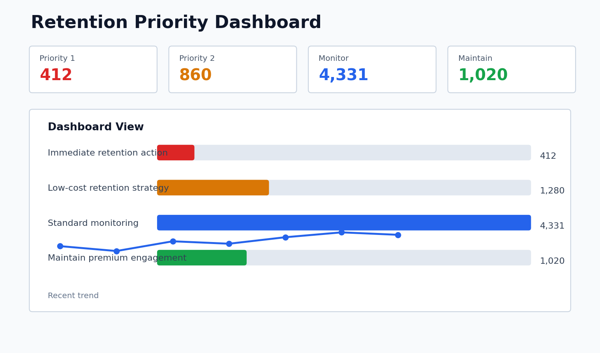

# Customer Churn Prediction & Customer Lifetime Value Engine

## Project Overview

This project is an end-to-end predictive analytics platform for telecom and subscription businesses. It predicts which customers are likely to churn, estimates customer lifetime value (LTV), explains model behavior with SHAP, logs predictions to PostgreSQL, and exposes the results through FastAPI and dashboard-ready analytics views.

In interview language: this is a production-style ML system with offline training, online inference, persistent prediction logging, explainability, Dockerized deployment, and CI/CD validation.

## Architecture



Customer data flows into PostgreSQL, is transformed through preprocessing and feature engineering, then served through churn and LTV models. FastAPI returns predictions and recommendations while PostgreSQL stores prediction history for dashboards and monitoring.

## Features

- Churn classification using Logistic Regression, Random Forest, and XGBoost
- LTV regression model for revenue prioritization
- SHAP explainability for model transparency
- FastAPI inference API with versioned endpoints
- JWT authentication and role-based access control
- PostgreSQL prediction logging with timestamps
- Metabase-ready dashboard layer
- Docker and Docker Compose deployment
- Prometheus, Grafana, and cAdvisor production monitoring
- GitHub Actions CI/CD workflows
- Pytest API and model checks

## Tech Stack

- Python
- FastAPI
- PostgreSQL
- SQLAlchemy
- Pandas and NumPy
- Scikit-learn
- XGBoost
- SHAP
- MLflow (Experiment Tracking & Model Registry)
- Apache Airflow (Workflow Orchestration)
- Docker and Docker Compose
- Metabase
- Prometheus
- Grafana
- cAdvisor
- GitHub Actions
- Pytest

## Project Structure

```text
customer-churn-ltv/
├── app/
│   ├── api/
│   ├── database/
│   ├── models/
│   ├── model_registry/
│   ├── services/
│   └── utils/
├── dashboards/
├── data/
├── docs/
│   └── screenshots/
├── reports/
├── tests/
├── docker/
├── .github/
│   └── workflows/
├── requirements.txt
├── Dockerfile
├── docker-compose.yml
├── README.md
└── app/main.py
```

## Setup Guide

Create and activate a virtual environment:

```bash
python3 -m venv .venv
source .venv/bin/activate
pip install -r requirements.txt
```

Run the API locally:

```bash
uvicorn app.main:app --reload
```

Run with Docker:

```bash
docker-compose up --build
```

Open:

- FastAPI docs: `http://localhost:8000/docs`
- Health check: `http://localhost:8000/health`
- Metabase dashboard: `http://localhost:3000`
- Prometheus: `http://localhost:9090`
- Grafana: `http://localhost:3001`
- cAdvisor: `http://localhost:8081`

## API Endpoints

| Method | Endpoint | Purpose |
|---|---|---|
| GET | `/health` | Service health check |
| GET | `/metrics` | Prometheus metrics scrape endpoint |
| GET | `/metrics/summary` | JSON monitoring summary |
| POST | `/register` | Create a user account |
| POST | `/login` | Login and receive a JWT bearer token |
| POST | `/api/v1/predict` | Generate churn, LTV, segment, and recommendation |
| POST | `/api/v1/predict/explain` | Generate churn prediction with SHAP explanation |
| POST | `/api/v1/predict/batch` | Generate batch churn predictions |
| GET | `/api/v1/predict/feature-importance` | Return model feature importance |
| GET | `/api/v1/model-info` | Return deployed model metadata; admin only |
| GET | `/admin/users` | List users; admin only |

## Authentication

Register a user:

```bash
curl -X POST http://localhost:8000/register \
  -H "Content-Type: application/json" \
  -d '{"username":"santosh","email":"test@email.com","password":"password123"}'
```

Login:

```bash
curl -X POST http://localhost:8000/login \
  -H "Content-Type: application/json" \
  -d '{"username":"santosh","password":"password123"}'
```

Use the returned token with protected APIs:

```bash
curl -X POST http://localhost:8000/api/v1/predict \
  -H "Authorization: Bearer YOUR_JWT_TOKEN" \
  -H "Content-Type: application/json" \
  -d @sample_request.json
```

Example model-info response:

```json
{
  "model_name": "xgboost_churn_model",
  "version": "v1",
  "accuracy": 0.791
}
```

## Dashboard Screenshots

### Airflow DAG Dashboard


### MLflow Dashboard


### KPI Dashboard


### Revenue-at-Risk Dashboard


### Customer Segments Dashboard


### Retention Priority Dashboard


## Results

Detailed metrics are documented in [reports/final_results.md](reports/final_results.md).

| Model | Metric | Value |
|---|---:|---:|
| XGBoost Churn | Accuracy | 0.791 |
| XGBoost Churn | Precision | 0.633 |
| XGBoost Churn | Recall | 0.508 |
| XGBoost Churn | F1 Score | 0.564 |
| LTV Model | MAE | 1.089 |
| LTV Model | RMSE | 1.995 |
| LTV Model | R2 | 0.999999 |

## Business Value

The system helps a business identify customers likely to leave, estimate revenue impact, prioritize high-value retention actions, and give non-technical teams dashboard visibility into customer risk. Instead of treating every customer the same, teams can focus incentives and outreach where they protect the most revenue.

## Resume Bullet Points

- Built an end-to-end Customer Churn Prediction and Lifetime Value Engine using FastAPI, PostgreSQL, XGBoost, SHAP, Docker, and Metabase.
- Developed dual machine-learning pipelines for churn classification and customer lifetime value prediction.
- Implemented REST APIs, CI/CD pipelines, Dockerized deployment, explainable AI, and executive analytics dashboards.

## Monitoring

The project includes a production monitoring stack:

- FastAPI exports Prometheus metrics at `/metrics`
- Prometheus scrapes FastAPI and cAdvisor every 15 seconds
- Grafana is provisioned with the `Customer Intelligence Monitoring` dashboard
- cAdvisor exposes container CPU, memory, filesystem, and uptime metrics
- Prometheus alert rules cover high latency, high error rate, and API downtime

Monitoring URLs:

- Prometheus: `http://localhost:9090`
- Grafana: `http://localhost:3001`
- cAdvisor: `http://localhost:8081`

Useful Prometheus queries:

```promql
prediction_requests_total
sum(rate(api_requests_total[5m])) by (endpoint)
histogram_quantile(0.95, sum(rate(request_duration_seconds_bucket[5m])) by (le))
time() - container_start_time_seconds
```

Default Grafana login:

```text
admin / admin
```

## Future Improvements

- Add alert notification channels such as email, Slack, or PagerDuty
- Add distributed tracing with OpenTelemetry
- Add Alembic migrations for database schema changes
- Export Metabase dashboard definitions as version-controlled assets
- Add batch CSV upload endpoint for business users
