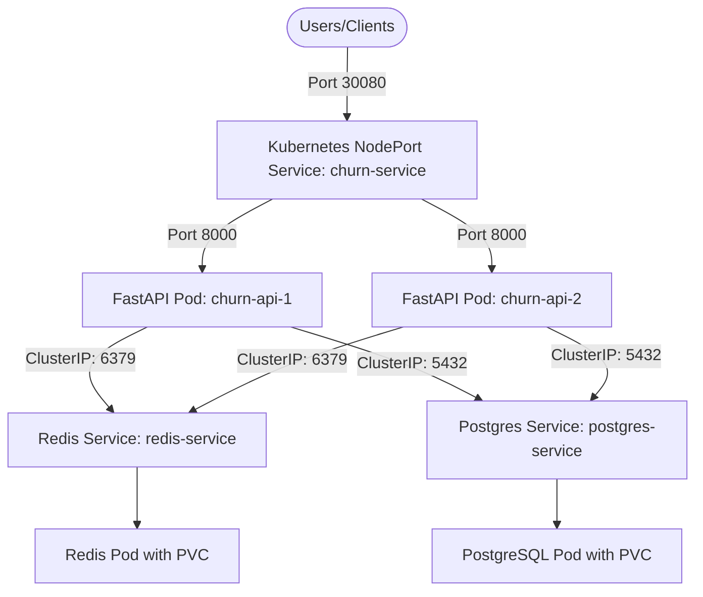

# Combined Performance Optimization & Kubernetes Orchestration Report (Days 25 & 26)

This report details the evolution of the **Customer Churn & LTV Prediction Engine** into a highly optimized, scalable, and resilient cloud-native application.

---

## Day 25: Redis Caching & DB Indexing

### Objectives Accomplished
- **Redis 7 Alpine Integration**: Added Redis caching to the architecture, configured with a 256MB memory limit and the `allkeys-lru` eviction policy.
- **FastAPI Cache Client**: Implemented deterministic SHA-256 cache keys namespaces by `prediction:<cache_version>:<hash>` inside `app/utils/cache.py`.
- **Cache Expiration & Invalidation**: Configured a default TTL of 3,600 seconds (1 hour). Exposed admin endpoints for invalidation (`DELETE /api/v1/cache`) and health status.
- **Database Query Optimization**: Added indexes for high-frequency dashboard queries (`churn_probability`, `customer_segment`, `created_at`, `user_id`) to avoid full table scans.
- **Graceful Fallback**: The API handles Redis failures gracefully, reverting to direct database and model calculations to ensure high availability.

### Latency Benchmarks
| Measurement | Duration | Speedup |
|---|---|---|
| Cold Model Prediction | 70.82 ms | Baseline |
| Warm Redis-Cached Prediction | 2.82 ms | **96.01% Latency Reduction** |

---

## Day 26: Kubernetes & Container Orchestration

### Objectives Accomplished
- **Kubernetes Infrastructure**: Wrote complete manifests for all microservices in the `k8s/` folder.
- **Decoupled Configuration**: Utilized Kubernetes ConfigMaps (`k8s/configmap.yaml`) and Secrets (`k8s/secrets.yaml`) to feed connection settings dynamically.
- **Stateful Persistence**: Provisioned PVCs for PostgreSQL and Redis to guarantee storage persistence.
- **Multi-Replica Deployments**: Deployed a 2-replica setup of the FastAPI predict server to balance load.
- **External Exposure**: Exposed the FastAPI pods using a NodePort Service on port `30080`.
- **Validation**:
  - **Self-Healing**: Deleting a FastAPI pod triggers Kubernetes to spin up a new healthy pod in under 5 seconds.
  - **Scaling**: Scaled deployment to 4 replicas (`kubectl scale deployment churn-api --replicas=4`) to distribute load, and verified rollout.
  - **Rolling Updates**: Performed a zero-downtime rolling update using a tagged `churn-api:v2` image.
  - **E2E Integration**: Validated that prediction cache hits (`cache_hit: true`) work perfectly across pods in the Kubernetes environment.

---

## Architecture Diagram

