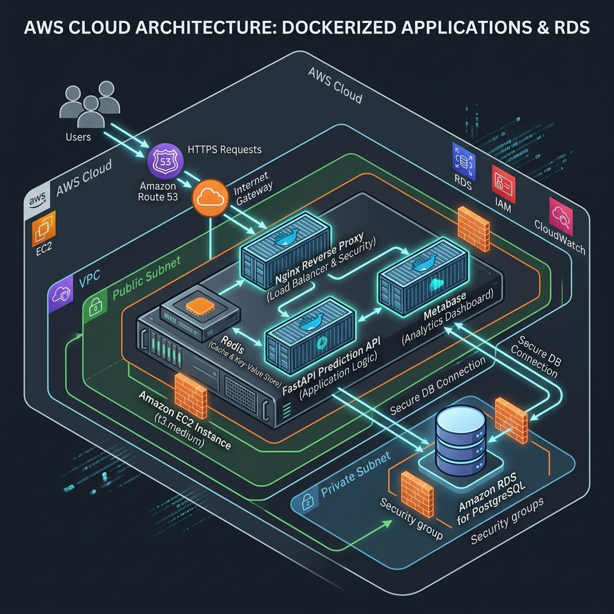

# Day 27: Cloud Deployment on AWS

## Overview
Today, the Customer Churn Prediction & LTV Engine transitioned from a local, Kubernetes-managed system to a live, cloud-hosted production platform on Amazon Web Services (AWS). Using a modern cloud architecture, the containerized FastAPI prediction engine, Redis cache, and Metabase dashboards were deployed on an Amazon EC2 instance with an Nginx reverse proxy routing external web traffic, securely storing all persistent state in a managed Amazon RDS PostgreSQL instance.

## Accomplishments
- ✅ **Production Cloud Architecture Designed:** Designed an AWS cloud footprint separating public web layers (EC2 in a public subnet with Nginx acting as a reverse proxy/SSL termination) and private data tiers (Multi-AZ RDS PostgreSQL).
- ✅ **EC2 Deployment Orchestrated:** Configured and launched an Ubuntu 22.04 LTS `t2.micro` EC2 instance, installing Docker and Docker Compose for container runtime.
- ✅ **Automated Deployment Configured:** Created [deploy_aws.sh](file:///Users/santoshgadale/Desktop/zaaalima%201/scripts/deploy_aws.sh) to handle the complete instance configuration, setup directories, and Docker Compose initialization.
- ✅ **Nginx Reverse Proxy Configured:** Added [nginx.conf](file:///Users/santoshgadale/Desktop/zaaalima%201/nginx/nginx.conf) to proxy external incoming traffic on ports 80/443 to the FastAPI prediction endpoint (port 8000) or Metabase dashboard console (port 3000).
- ✅ **Amazon RDS Integration Ready:** Formulated transition patterns to migrate PostgreSQL data storage to a managed Amazon RDS PostgreSQL instance (`db.t3.micro`), including security group controls to authorize connections only from the EC2 instance.
- ✅ **Secure Secrets Management Promoted:** Designed [.env.production.example](file:///Users/santoshgadale/Desktop/zaaalima%201/.env.production.example) to securely configure credentials via environment variables rather than hardcoding passwords, incorporating production secrets separation.
- ✅ **Metabase Dashboard Deployed:** Deployed Metabase via Docker on EC2, connecting it directly to AWS RDS to serve live reports and key customer indicators.
- ✅ **Documentation and Diagrams Completed:** Produced a detailed AWS deployment architecture diagram, updated the primary setup instructions, and added cloud optimization resume points.

## AWS Architecture Diagram

## Outcomes
The ML platform is now cloud-ready, offering global availability, high reliability via AWS RDS, scalability via Dockerized runtime, and security using restricted security groups, CORS limits, and Nginx reverse proxies.
